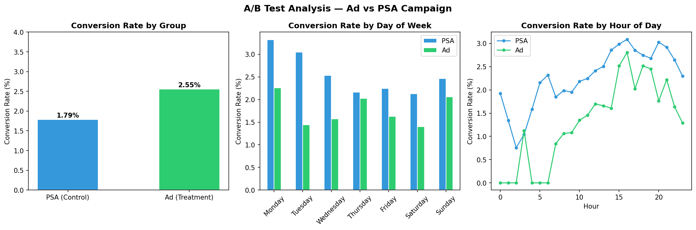
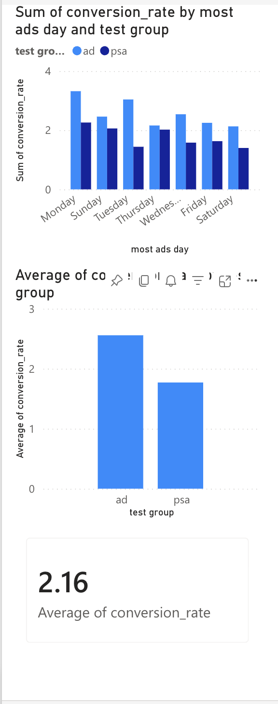

# A/B Test Analysis — Ad vs PSA Campaign

## Project Overview
Analyzed 588,101 user sessions to determine whether an ad campaign significantly 
outperforms a public service announcement (PSA) in driving conversions, using 
statistical hypothesis testing and Power BI visualization.

## 🔑 Key Results
| Metric | Value |
|---|---|
| Ad Conversion Rate | 2.55% |
| PSA Conversion Rate | 1.79% |
| Relative Lift | +43.1% |
| Z-Statistic | 7.370 |
| P-Value | ~0.000000 |
| Statistical Significance | ✓ Yes (p < 0.05) |
| Estimated Extra Revenue/Year | $461,547 |

## Tools & Technologies
- Python (pandas, scipy, statsmodels, matplotlib)
- Statistical hypothesis testing (two-proportion z-test)
- Power BI (interactive dashboard)
- SQL-style cohort analysis

## Methodology
1. Cleaned 588k rows — removed duplicates, validated group assignments
2. Calculated baseline conversion rates per group
3. Ran two-proportion z-test at 95% confidence level
4. Segmented results by day of week and hour of day
5. Quantified business impact in estimated annual revenue

## Key Findings
1. The ad campaign converts at 2.55% vs 1.79% for PSA — a 43.1% relative lift
2. Monday shows the highest conversion rate for ads (3.32%) — best day to run campaigns
3. Ad group has near-zero conversions before hour 5 — nighttime ads are wasted spend
4. The result is statistically significant with p ≈ 0 and z = 7.37
5. At 100k monthly users, the ad campaign generates ~$461k extra revenue per year

## Recommendation
**Launch the ad campaign.** The result is statistically significant, practically 
meaningful, and consistent across all days of the week. Focus ad spend on Monday 
mornings and avoid running ads between midnight and 5am.

## Dashboard Preview

